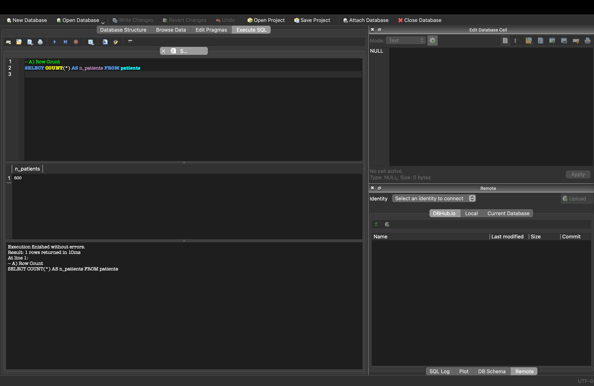
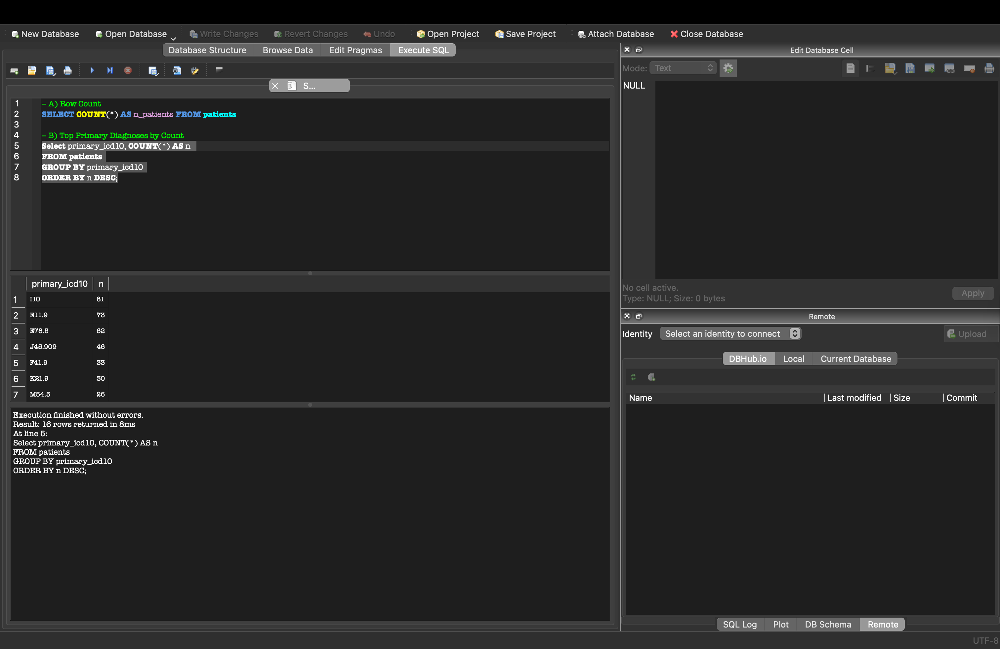
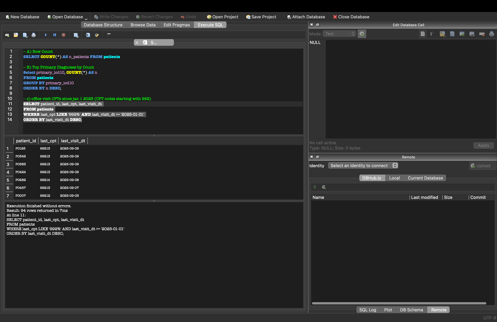
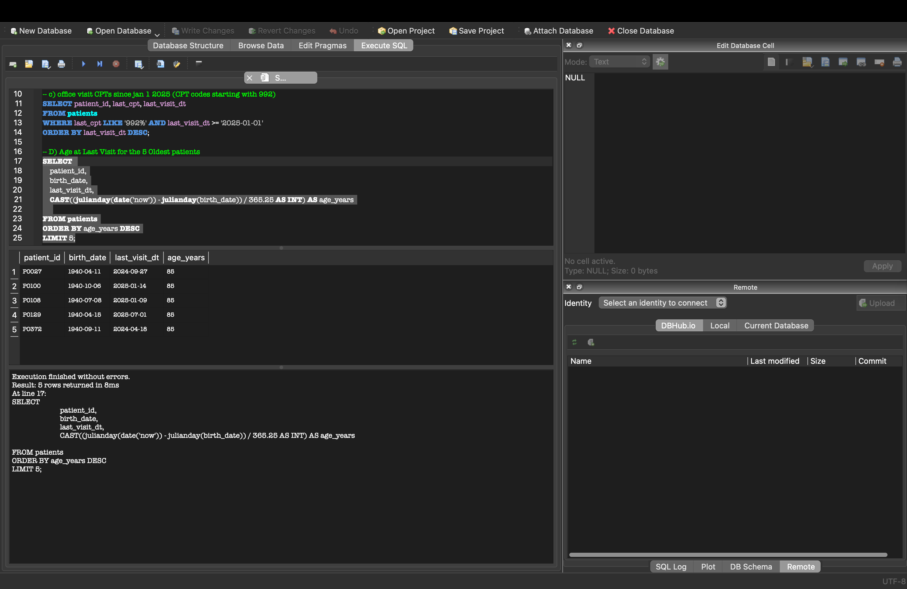
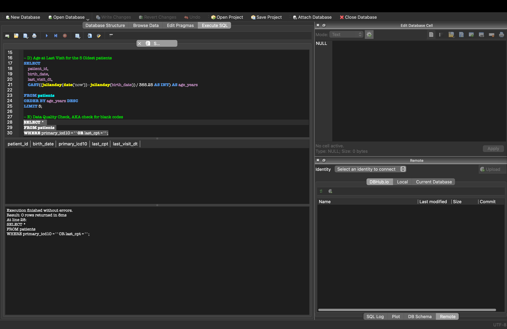

# SQLite, Python, and Databases 

## Project Overview
For this project we focused primarily with familiarizing ourselves with SQL, navigating the DB Browser in SQLite, and using python to create a patient database compatible with the DB Browser. A project scaffold was created to organize our dat, sql queries, and python sources. After creating the data we navigated SQL and ran common queries that can be used in a real life situations and also nooted how the SQLite responded to the queries while navigating any erros that may show up. 

## Steps 
1. Begin by defining the schema in the schema.sql file by using a SQL query. This is how the data will be categorized and stored. 

2. Import the patient csv file and review it. 

3. Include the necessary packages in the requirements.txt file and then install dependencies using "pip3 install -r requirements.txt" in a new terminal 

4. Create a databse using python script in the create_db.py file, then the file in a new terminal.

5. Use python script to load the patient csv file into the database so it may be used.

6. From here use DB Browser for SQLite to open the clinic_simple.db 

7. Run sql queries for the data you seek. 

## SQL Query Results 

### Query A
Query A was used to calculate how many rows in total are in this specific database in terms of n_patients. The results show us that there are 500 total rows. 

### Query B 
Query B was used to find out what the top icd10 diagnoses are with their corresponding total amount of diagnoses. We see the results are organized in descending order from the value in the n column on the right. On the left we see the corresponding ICD10 code.  

### Query C 
Query C was used to find all patients with a CPT code starting with "992" and when their last visit was starting from January 1, 2025. SQL gave us 94 patients that fit that criteria along with the date of their last visit.   

### Query D
Query D was used to find the age of the 5 oldest patients in the dataset and when their last visit was. From the results we can see that the 5 oldest patients were all 85 years old at the time of their last visit.

###### P0027 and P0129 were close to being birthday twins

### Query E 
Query E was used to run a quality check of the data in the database. As we can see there were no blank spots in the data which strengthens the integrity of our data. 

